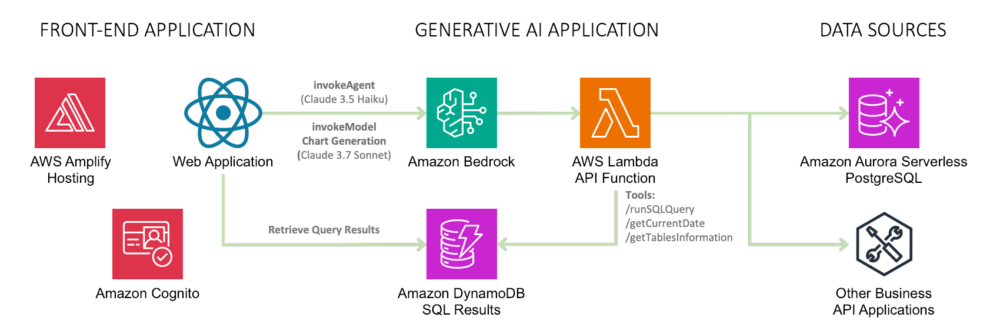
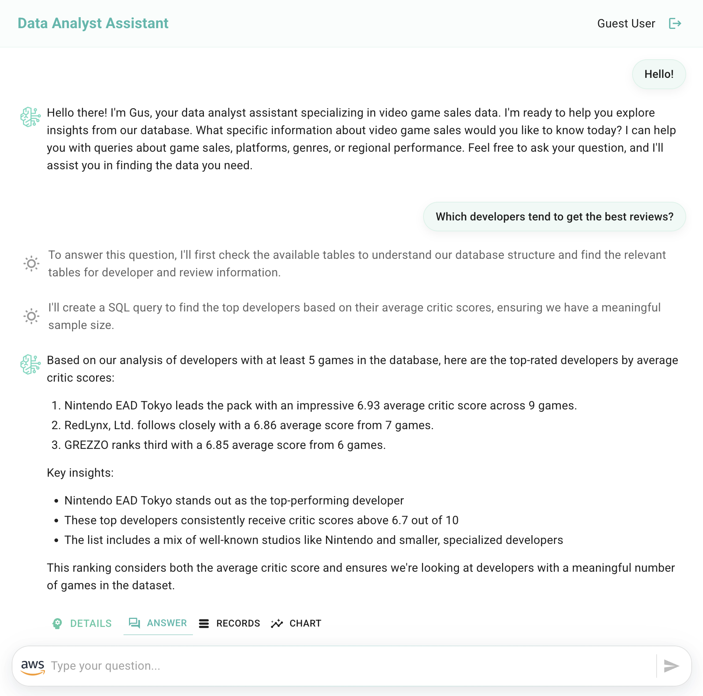
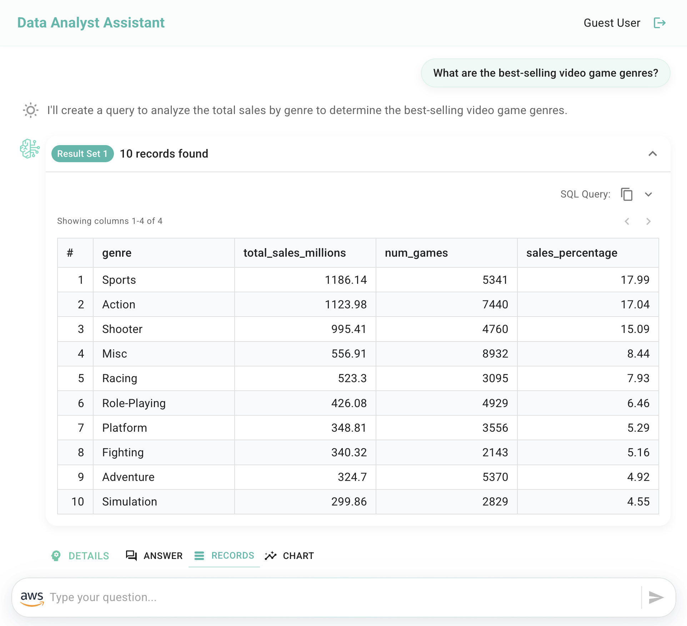

# Deploying a Conversational Data Analyst Assistant Solution with Amazon Bedrock Agents

> [!IMPORTANT]
> **⚡ Enhanced Deployment Option**: This solution can also be deployed using **Amazon Bedrock AgentCore** - Agentic platform to build, deploy and operate agents securely at scale using any framework and model.
> 
> **🔥 [Deploy with Amazon AgentCore →](https://github.com/awslabs/amazon-bedrock-agentcore-samples/tree/main/02-use-cases/video-games-sales-assistant)**

> [!IMPORTANT]
> **🚀 Extensible Foundation**: Use this solution as a starting point for other data use cases. Extend the agent with custom tools for your specific business needs and adapt it to different industries and data sources.

This solution provides a Generative AI application reference that allows users to interact with data through a natural language interface. The solution connects Amazon Bedrock Agents to a PostgreSQL database, providing data analysis capabilities through a Web Application interface.

🤖 A Data Analyst Assistant offers an approach to data analysis that enables enterprises to interact with their structured data through natural language conversations rather than complex SQL queries. This kind of assistant provides an intuitive question-answering for data analysis conversations and can be improved by offering data visualizations to enhance the user experience.

✨ This solution enables users to:

- Ask questions about video game sales data in natural language
- Receive AI-generated responses based on SQL queries to a PostgreSQL database
- View query results in tabular format
- Explore data through automatically generated visualizations
- Get insights and analysis from the AI assistant

🚀 This reference solution can help you explore use cases like:

- Empower analysts with real-time business intelligence
- Provide quick answers to C-level executives for common business questions
- Unlock new revenue streams through data monetization (consumer behavior, audience segmentation)
- Optimize infrastructure through performance insights

## Solution Overview

The following architecture diagram illustrates a reference solution for a generative AI data analyst assistant that is powered by Amazon Bedrock Agents. This assistant enables users to access structured data that is stored in a PostgreSQL database through a question-answering interface.

> [!IMPORTANT]
> This sample application is meant for demo purposes and is not production ready. Please make sure to validate the code with your organizations security best practices.
> 
> Cost Alert: This solution will cost approximately $180 USD per month, mainly for Aurora Serverless and RDS Proxy, plus the usage of on-demand services like Amazon Bedrock and Lambda functions. Please ensure you understand these costs before deployment.

The solution deploys the following AWS services:

- **Amazon Bedrock Agent**: Powers the ***Data Analyst Assistant*** that answers questions by generating SQL queries using Claude 3.5 Haiku
- **AWS Lambda**: Processes agent requests through various tools including:
    - /runSQLQuery: Executes queries against the database
    - /getCurrentDate: Retrieves the current date
    - /getTablesInformation: Provides database tables information for agent context
- **Aurora Serverless PostgreSQL**: Stores the video game sales data
- **Amazon DynamoDB**: Tracks questions and query results
- **AWS Secrets Manager**: Securely stores database credentials
- **Amazon VPC**: Provides network isolation for the database
- **React Web Application**: Delivers the user interface for the assistant
    - Uses Amazon Cognito for user authentication and permissions management
    - The application invokes the Amazon Bedrock Agent for interacting with the assistant
    - For chart generation, the application directly invokes the Claude 3.7 Sonnet model

> [!NOTE]
> The React Web Application uses Amazon Cognito for user authentication and permissions management, providing secure access to Amazon Bedrock and Amazon DynamoDB services through authenticated user roles.

> [!TIP]
> You can also change the data source to connect to your preferred database engine by adapting both the Agent's instructions and the AWS Lambda API function logic.

> [!IMPORTANT] 
> Enhance AI safety and compliance by implementing **[Amazon Bedrock Guardrails](https://aws.amazon.com/bedrock/guardrails/)** for your AI applications.

The **user interaction workflow** operates as follows:

- The web application sends user business questions to the Amazon Bedrock Agent
- The agent (powered by Claude 3.5 Haiku) processes natural language and determines when to execute database queries
- Lambda functions execute SQL queries against the Aurora PostgreSQL database and send the results back to the agent, which formulates an answer to the question
- After the agent's response is received by the web application, the raw data query results are retrieved from the DynamoDB table to display both the answer and the corresponding records
- For chart generation, the application invokes a model (powered by Claude 3.7 Sonnet) to analyze the agent's answer and raw data query results to generate the necessary data to render an appropriate chart visualization

## Deployment Instructions

The deployment consists of two main steps:

1. **Generative AI Application** - [Data Source and Amazon Bedrock Agent Deployment with AWS SAM](./sam-bedrock-video-games-sales-assistant/)
2. **Front-End Implementation** - [Integrating Amazon Bedrock Agent with a Ready-to-Use Data Analyst Assistant Application](./amplify-video-games-sales-assistant-bedrock-agent/)

> [!NOTE]
> *It is recommended to use the Oregon (us-west-2) or N. Virginia (us-east-1) regions to deploy the application.*

> [!IMPORTANT] 
> Remember to clean up resources after testing to avoid unnecessary costs by following the clean-up steps provided.

## Application Features

The following images showcase a conversational experience analysis that includes: natural language answers, the reasoning process used by the LLM to generate SQL queries, the database records retrieved from those queries, and the resulting chart visualizations.

- **Conversational interface with an agent responding to user questions**

- **Detailed answers including the rationale behind SQL query generation**

- **Raw query results displayed in tabular format**

- **Chart visualization generated from the agent's answer and the data query results (created using [Apexcharts](https://apexcharts.com/))**.

- **Summary and conclusion derived from the data analysis conversation**

## Thank You

## License

This project is licensed under the Apache-2.0 License.