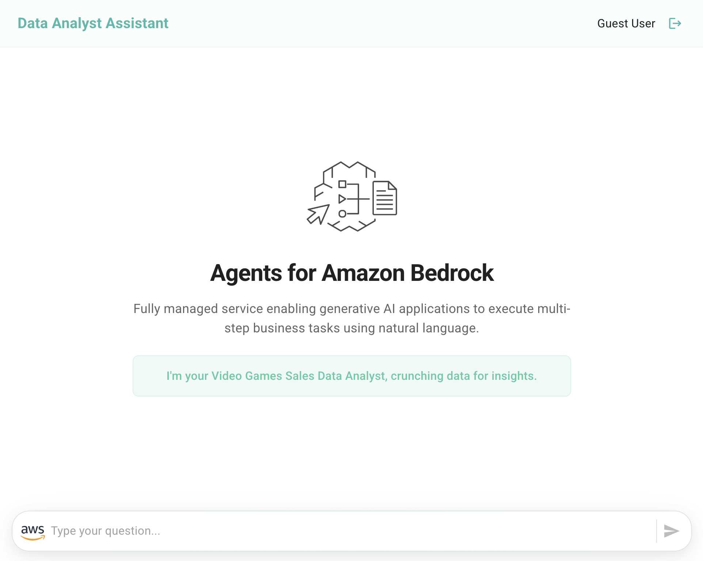
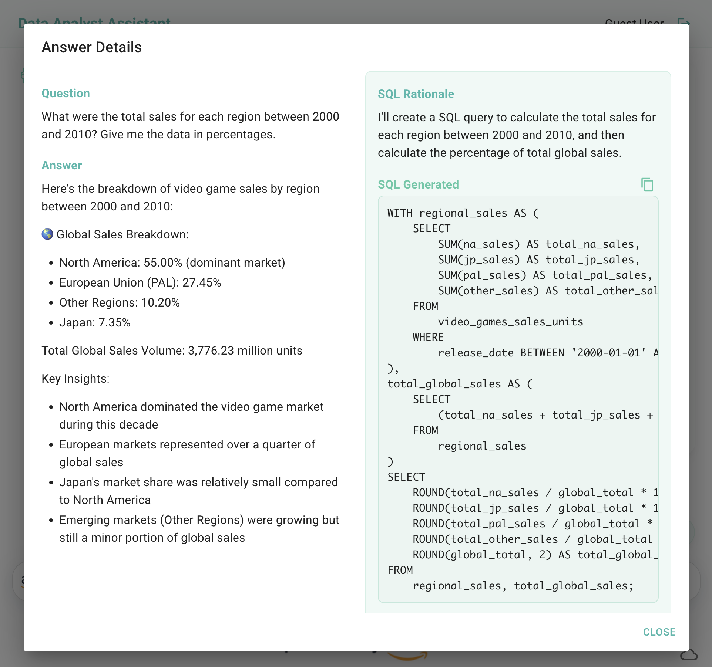

# Front-End Implementation - Integrating Amazon Bedrock Agent with a Ready-to-Use Data Analyst Assistant Application

This tutorial guides you through setting up a React Web application that integrates with your Amazon Bedrock Agent, creating a Data Analyst Assistant for Video Game Sales.

## Overview

By the end of this tutorial, you'll have a fully functional Generative AI web application that allows users to interact with a Data Analyst Assistant interface.

The application consists of two main components:

- **React Web Application**: Provides the user interface and handles user interactions
- **Amazon Bedrock Integration:**:
    - Uses your Bedrock Agent for data analysis and natural language processing
    - Directly invokes Claude 3.7 Sonnet model for chart generation and visualization

> [!IMPORTANT]
> This sample application is for demonstration purposes only and is not production-ready. Please validate the code against your organization's security best practices.

## Prerequisites

Before you begin, ensure you have:

- An **Alias** created for your Amazon Bedrock Agent from the **Generative AI Application - Data Source and Amazon Bedrock Agent Deployment** tutorial
- [Node.js version 18+](https://nodejs.org/en/download/package-manager)
- React Scripts installed:
``` bash
npm install react-scripts
```

## Set Up the Front-End Application

### Install Dependencies

Navigate to the React application folder (amplify-video-games-sales-assistant-bedrock-agent/) and install the dependencies:

``` bash
npm install
```

### Install Amplify CLI

Install the Amplify CLI globally:

``` bash
npm install -g @aws-amplify/cli
```

### Initialize Amplify Project

Initialize the Amplify project:

``` bash
amplify init
```

Use the following configuration:

? Enter a name for the project: **daabedrockagent**

Use the following default configuration:

| Name: **daabedrockagent**
| Environment: dev
| Default editor: Visual Studio Code
| App type: javascript
| Javascript framework: react
| Source Directory Path: src
| Distribution Directory Path: build
| Build Command: npm run-script build
| Start Command: npm run-script start

? Do you want to use an AWS profile? **Yes (select your AWS profile)**

### Add Authentication

Add Amazon Cognito authentication to enable user sign-in:

``` bash
amplify add auth
```

Use the following configuration:

- Service: `Cognito`
- Configuration: `Default configuration`
- Sign-in method: `Email`
- Advanced settings: `No, I am done`

 Do you want to use the default authentication and security configuration? **Default configuration**
 
 How do you want users to be able to sign in? **Email**
 Do you want to configure advanced settings? **No, I am done**

### Deploy Backend Resources

Deploy the authentication resources to AWS:

``` bash
amplify push
```

> [!NOTE]
> This creates a Cognito User Pool and Identity Pool in your AWS account for user authentication. AWS credentials for the Front-End Application are automatically managed through Cognito.

## Configure AuthRole Permissions

After authentication deployment, you need to grant your authenticated users permission to access AWS services.

1. **Find your AuthRole**: Go to AWS Console → IAM → Roles → Search for amplify-daabedrockagent-dev-*-authRole
2. **Add this policy** (replace the placeholder values with your actual values from SAM outputs):

``` json
{
    "Version": "2012-10-17",
    "Statement": [
        {
            "Sid": "InvokeBedrockAgent",
            "Effect": "Allow",
            "Action": [
                "bedrock:InvokeAgent"
            ],
            "Resource": [
                "<agent_arn>",
                "arn:aws:bedrock:*:<account_id>:agent-alias/<agent_id>/*"
            ]
        },
        {
            "Sid": "InvokeBedrockModel",
            "Effect": "Allow",
            "Action": [
                "bedrock:InvokeModel"
            ],
            "Resource": [
                "arn:aws:bedrock:*:<account_id>:inference-profile/us.anthropic.claude-3-7-sonnet-20250219-v1:0",
                "arn:aws:bedrock:us-east-2::foundation-model/anthropic.claude-3-7-sonnet-20250219-v1:0",
                "arn:aws:bedrock:us-east-1::foundation-model/anthropic.claude-3-7-sonnet-20250219-v1:0",
                "arn:aws:bedrock:us-west-2::foundation-model/anthropic.claude-3-7-sonnet-20250219-v1:0"
            ]
        },
        {
            "Sid": "DynamoDB",
            "Effect": "Allow",
            "Action": [
                "dynamodb:Query"
            ],
            "Resource": "<question_answers_table_arn>"
        }
    ]
}
```

## Configure Environment Variables

Rename the file **src/sample.env.js** to **src/env.js**:

``` bash
mv src/sample.env.js src/env.js
```

In you **src/env.js** update the following environment variables

 - AWS Region:
     - **AWS_REGION**

 - Agent and DynamoDB table name information that you can find in the CloudFormation Outputs from the SAM project:
     - **AGENT_ID**
     - **AGENT_ALIAS_ID**
     - **QUESTION_ANSWERS_TABLE_NAME** 

## Test Your Data Analyst Assistant

Start the application locally:

``` bash
npm start
```

The application will open in your browser at http://localhost:3000.

First-Time access:
1. **Create Account**: Click "Create Account" and use your email address
2. **Verify Email**: Check your email for a verification code
3. **Sign In**: Use your email and password to sign in

Try these sample questions to test the assistant:

```
Hello!
```

```
How can you help me?
```

```
What is the structure of the data?
```

```
Which developers tend to get the best reviews?
```

```
What were the total sales for each region between 2000 and 2010? Give me the data in percentages.
```

```
What were the best-selling games in the last 10 years?
```

```
What are the best-selling video game genres?
```

```
Give me the top 3 game publishers.
```

```
Give me the top 3 video games with the best reviews and the best sales.
```

```
Which is the year with the highest number of games released?
```

```
Which are the most popular consoles and why?
```

```
Give me a short summary and conclusion of our conversation.
```

## Deploy your Application with Amplify Hosting

To deploy your application yu can use AWS Amplify Hosting:

### Add Hosting

Add hosting to your Amplify project:

``` bash
amplify add hosting
```

Use the following configuration:
- Select the plugin module: `Hosting with Amplify Console`
- Type: `Manual deployment`

### Publish Application

Build and deploy your application:

``` bash
amplify publish
```

This will build your React application and deploy it to AWS Amplify Hosting. You'll receive a URL where your application is accessible.

## Application Features

Congratulations! Your Data Analyst Assistant can provide you with the following conversational experience:



- **Conversational interface with an agent responding to user questions**


- **Detailed answers including the rationale behind SQL query generation**



- **Raw query results displayed in tabular format**


- **Chart visualization generated from the agent's answer and the data query results (created using [Apexcharts](https://apexcharts.com/))**.


- **Summary and conclusion derived from the data analysis conversation**


## Thank You

## License

This project is licensed under the Apache-2.0 License.